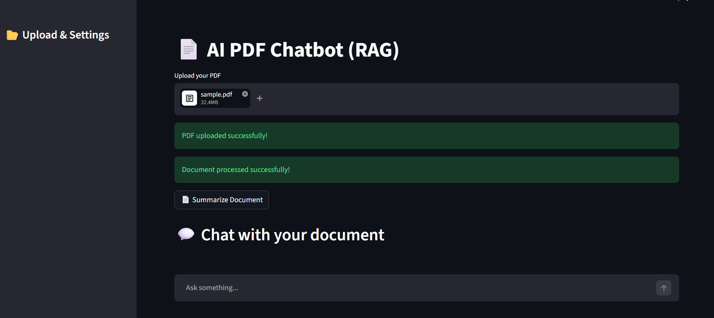
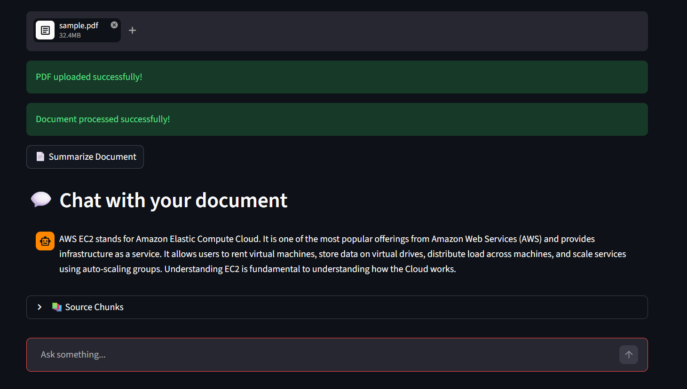
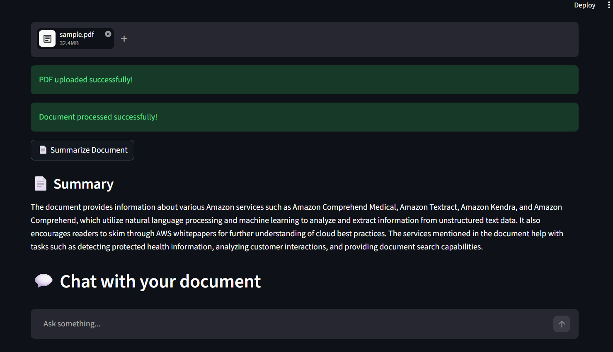

# 📄 AI PDF Chatbot (RAG)

An AI-powered PDF chatbot built using **Retrieval-Augmented Generation (RAG)** that allows users to upload documents and ask context-aware questions with accurate, source-grounded answers.

---

## 📸 Demo Screenshots

### 📄 Upload & Processing


### 💬 Chat Interface


### 📄 Document Summary


---

## 🚀 Features

- 📤 Upload and process PDF documents  
- 💬 Ask questions and get precise answers  
- 🧠 Semantic chunking for better context understanding  
- 🔍 Vector similarity search using FAISS  
- ❌ Hallucination control (answers only from document)  
- 📄 Document summarization  
- ⚡ Fast performance with caching  
- 💬 Chat history (ChatGPT-like UI)  
- 📚 Source chunk display for transparency  

---

## 🧠 Tech Stack

- Python  
- Streamlit  
- LangChain  
- OpenAI API  
- FAISS (Vector Database)  

---

## 🏗️ Architecture

1. PDF uploaded by user  
2. Text is extracted and split into chunks  
3. Chunks are converted into embeddings  
4. Stored in FAISS vector database  
5. User query → similarity search  
6. Relevant chunks passed to LLM  
7. LLM generates context-aware answer  

---

## ▶️ How to Run Locally

```bash
git clone https://github.com/your-username/rag-pdf-chatbot.git
cd rag-pdf-chatbot

pip install -r requirements.txt
python -m streamlit run app.py
